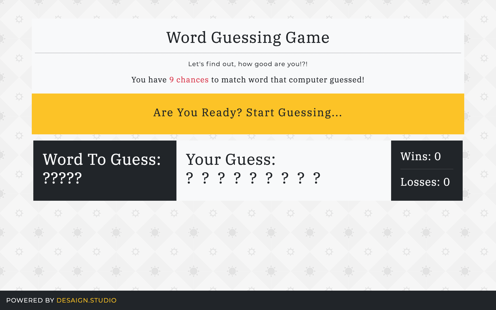

# Word Guessing Game

Guess the word like "Wheel of Fortune".

### Gameplay

- You have to guess a word.
- You have 9 chances to match that word!
    - All words are in 5 letters.
    - ?????
- Keep guessing until word discover or you miss last chance!
- Computer generate new word randomly.
- Display in **Yellow** have your answer!

### Version

- **2103161000**
✔ Last Update @done (March 24th 2021, 15:33)

### Framework

- HTML5, CSS3, JavaScript

### Built With

- JQuery, Bootstrap, Google Fonts, SVG

### Software

- Visual Studio Code Editor
- Github for versioning

### CONTRIBUTE

- A [contributing guideline](https://github.com/kratuvwxyz/CONTRIBUTE) available.

### LICENSE

- [MIT](https://github.com/kratuvwxyz/LICENSE) © 2021 Kratu Desai, DESAIGN LLC.

## CONTACT

Thank you for your time and consideration. My mantra is simple, *chase perfection to catch excellence*. I hope you enjoy my work. **I'd love to hear from you.** Please email me at <a href="mailto:github@desaign.studio?Subject=Message from Github">github@desaign.studio</a>.

 &copy; 2011-2021. <a href="https://desaign.app" target="_blank" style="text-decoration:none;">DESAIGN STUDIO</a>. All Rights Reseverd. &#160;
 &#160;
 &#160;
 &#160;
 &#160;

